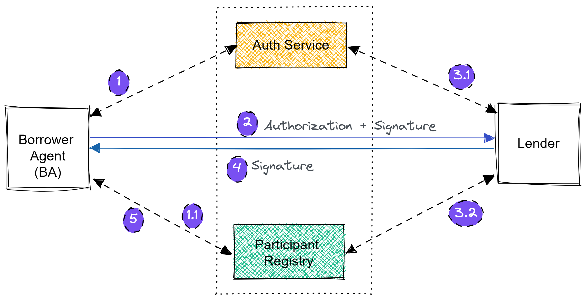

# Intro
All participants must follow the security requirements while transmitting data over API calls. On a high level, these are the security aspects that need to be ensured.

1. HTTPS - All API calls must be done securely over HTTPS
2. Two-way TLS -  The system should use Two-way TLS to ensure that both parties can send the information securely
3. Digital Signature - All communication between the participants should be digitally signed as per the JSON Web Signature Specification
4. Post participant registration with the Participant Registry, the private / public keys for authentication will be available in the portal

Every OCEN participant may be an API provider or an API client. In these roles:

1. API Clients need an access token to present to the API providers to authorize the calls.
2. API providers need access to the public key of token issuing OCEN Auth Service to validate the access token presented by an API client.
3. Upon identifying the API caller using the access token, API providers need access to the public key of the API caller available at the Gateway to verify the integrity of the digitally signed request sent by the API client.
4. Along similar lines to (3), API Clients, while receiving the response to their requests, also need access to the API Provider’s public key to verify the digitally signed response from the API provider.

Following is a sample interaction between a Lender and a Borrower Agent(BA), following the security guidelines mentioned here:

1. Borrower Agent(BA) obtains an access token from Auth Service
    1. Uses the access token to fetch endpoint location of the lender(s).
2. Borrower Agent(BA) call lender(s), attaches the access token to `Authorization` header & attaches body `Signature` header as well.
3. Lender, fetches two keys, to validate incoming requests: 
    1. Public key of the Auth service to verify the Authorization header
    2. Public key of the Borrower Agent(BA), registered on the Gateway, to verify the Signature header.
4. Respond back to Borrower Agent(BA), with response body `Signature` header attached.
5. Borrower Agent(BA), fetches public key of the lender from gateway & processes the request if valid.